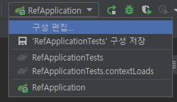
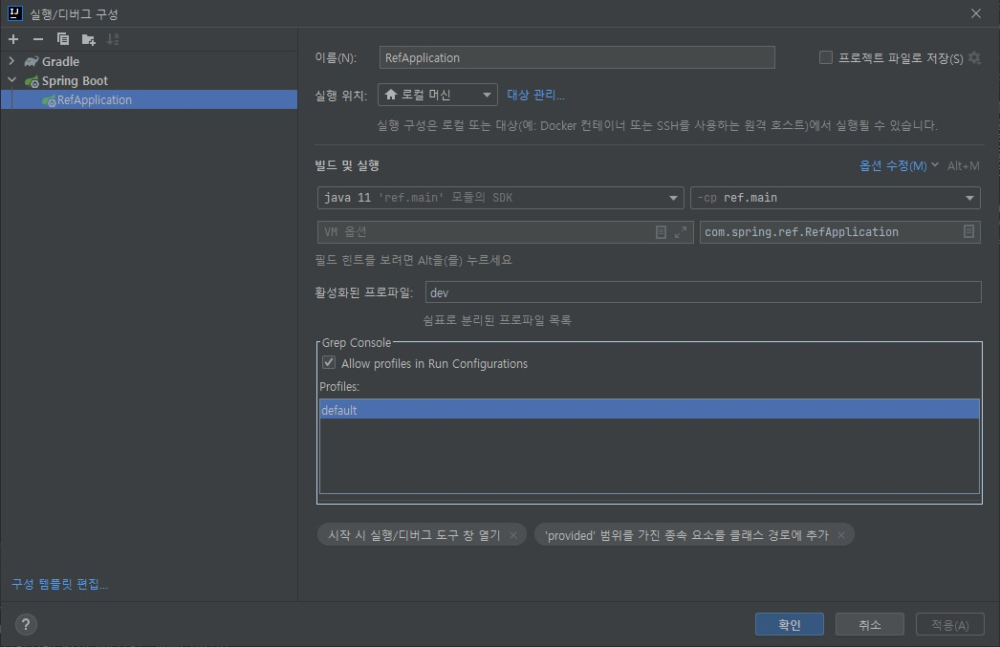

#Spring API Reference

### 프로파일 셋팅 방법
- jar파일로 실행시 property 설정방법 : "-Dspring.profiles.active=dev"
- intellij-Commnuity : VM 옵션 값에 추가 "-Dspring.profiles.active=dev"
- intellij-Ultimate : Ul활성화된 프로파일 항목에 application-[name].[yaml | properties | xml] 으로 name 값을 추가 해주면 된다   
  아무 것도 없는 경우 application.yaml 설정이 적용됨.   
  application-dev.yaml 파일을 추가하고 dev 활성화된 프로파일에 "dev" 를 추가하면 해당 설정값이 적용된다.   

     
  

